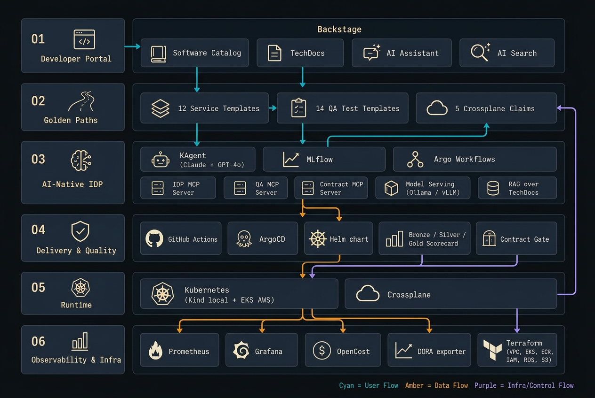
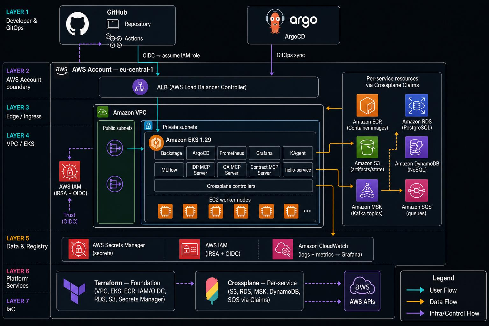
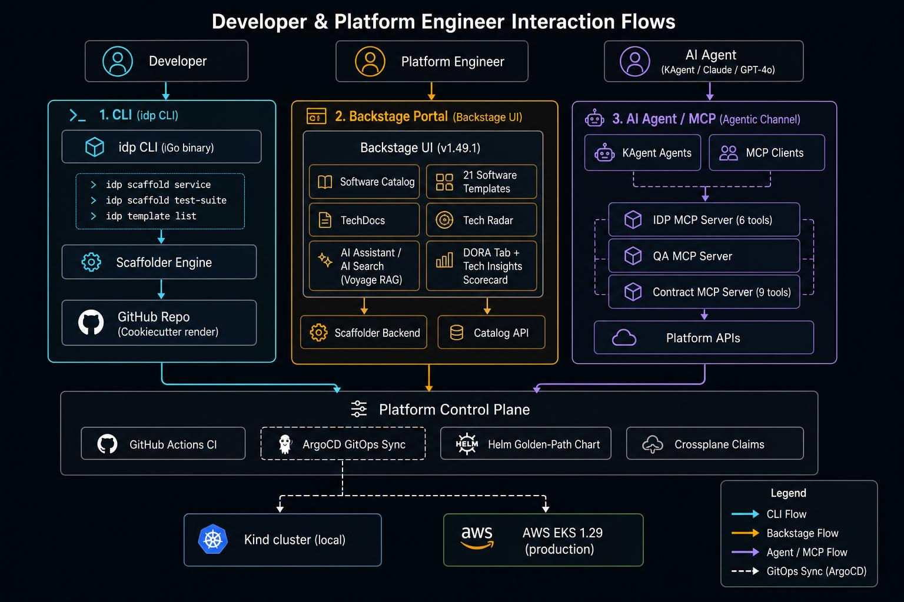

<div align="center">

# 🚀 Backstage Platform Template

### A production-ready Internal Developer Platform — in a single `git clone`

[](LICENSE)
[](https://github.com/moatazeldebsy/backstage-platform-template/actions/workflows/ci.yml)
[](https://moatazeldebsy.github.io/backstage-platform-template/)
[](https://github.com/users/moatazeldebsy/projects/5)
[](https://github.com/moatazeldebsy/backstage-platform-template/stargazers)
[](https://github.com/moatazeldebsy/backstage-platform-template/network/members)

**A production-ready Internal Developer Platform template** — Backstage developer portal, golden-path Helm chart, 21 service & app templates (including 7 mobile) + 18 QA/test scaffold templates + 5 Crossplane Claim templates + 4 multi-region V2 templates, AI/ML platform (KAgent + MLflow + 3 MCP servers), shift-left quality programme (Bronze/Silver/Gold scorecard + contract testing), Prometheus + Grafana observability + DORA entity tab, AWS EKS via Terraform, per-service cloud resources via Crossplane, and an opt-in **V2 multi-region architecture** (active-standby eu-central-1 + us-east-1). Runs locally on Kind in ~15 minutes.

> **Using this template?** Click **"Use this template"** above, then run `./scripts/setup.sh` to personalise all placeholders for your org.

> **First time?** Always run `./scripts/setup.sh` first. It replaces `moatazeldebsy` and other placeholders across all config files. If you skip this step, ArgoCD will generate no apps because its ApplicationSet still has the unresolved `moatazeldebsy` placeholder.



</div>

> **v2 Multi-Region is now on `main`:** Active-passive AWS across eu-central-1 (primary) + us-east-1 (standby) — Aurora Global DB, DynamoDB Global Tables, S3 cross-region replication, Transit Gateway, CloudFront + WAF, Global Accelerator, Karpenter spot autoscaling, Thanos multi-region metrics, Backstage warm standby, and automated failover runbook. Single-region setups are unaffected — multi-region is opt-in via `./scripts/bootstrap-multiregion.sh`. See [docs/multi-region.md](docs/multi-region.md).

## Compatibility

| Component | Tested version |
|---|---|
| Backstage | v1.49.1 |
| Kubernetes | 1.29 (EKS) · 1.33.1 (Kind) |
| Helm | 3.x / 4.x |
| Kind | ≥ 0.27 |
| ArgoCD | v3.4 (chart 9.5.13) |
| Terraform | ≥ 1.5 |
| Go (hello-service) | 1.26 |
| Node.js (Backstage) | 24 LTS |

---

## What You Get

| Capability | Details |
|---|---|
| **Developer portal** | Backstage v1.49.1 with catalog, TechDocs, Tech Radar (63 entries), and custom scaffolder actions |
| **Software templates** | 51 scaffold templates versioned with `v1` tag; 7 **blessed** golden-path templates (Node.js, Python, Go, React, Team namespace, Add-secret, Decommission); 44 **advanced** templates for infra, QA, mobile, AI/ML, and multi-region (V2). All indexed in `backstage/catalog/all-templates.yaml` — adding a template requires one line there, no `app-config` edit. |
| **QA / test templates** | 18 testing scaffold templates — Playwright E2E, k6 Performance, Pact Contract, Newman API, ZAP DAST, Datadog Synthetic, Visual Regression, Accessibility (axe), BDD Cucumber, Appium Mobile, Chaos Mesh, Stryker Mutation, Testcontainers Integration, DeepEval LLM Eval, Unit, Component, IaC, Flutter Integration — plus `enable-contract-testing` for MCP-driven contract gates |
| **Team isolation** | Per-team namespace (quota + LimitRange + NetworkPolicy + ArgoCD AppProject + ApplicationSet); per-team SecretStore scoped to `/<team>/*` in Secrets Manager; Kyverno auto-injects `idp:team` tag on all Crossplane claims; per-team Grafana folder. See [docs/team-management.md](docs/team-management.md). |
| **Mobile platform** | 7 mobile golden-path templates (Android/iOS/Flutter/SDK/Code Signing/App Store/Device Farm); 5 mobile Tech Insights scorecard checks; Appium + Firebase TestLab device-farm testing. See [docs/mobile-platform.md](docs/mobile-platform.md). |
| **Golden-path chart** | Single reusable Helm chart for all services — health checks, metrics, RBAC pre-wired; PodDisruptionBudget (default minAvailable: 1), optional Argo Rollouts canary with auto-rollback |
| **Shift-left quality** | Bronze/Silver/Gold scorecard (11 checks + 5 mobile checks, visible in Backstage Tech Insights + Grafana); PR gates for coverage ≥70%, vuln scan, static analysis; ArgoCD PreSync contract gate blocks breaking API changes. See [docs/shift-left-leadership.md](docs/shift-left-leadership.md) for the programme overview. |
| **AI/ML platform** | **AI-Native IDP (Phase 7a Complete)** — KAgent agents (Claude + OpenAI GPT-4o) + MLflow experiment tracking + **IDP MCP Server** (6 tools) + **QA MCP Server** (QA-specific tools) + **Contract MCP Server** (9 contract tools) + Model Serving API (Ollama/vLLM) + AI Scorecard (Bronze/Silver/Gold) + Prompt Lifecycle Management (ConfigMaps) + Argo Workflows (ML pipelines) + Cost Attribution (team labels + metrics) + AI Observability Dashboard + RAG semantic search over TechDocs + KAgent guardrails (structured audit log, dry_run mode, per-agent attribution) |
| **Observability** | Prometheus + Grafana (local) / CloudWatch + Grafana (AWS); Loki log aggregation + Grafana Tempo distributed tracing (local + AWS); PagerDuty on-call escalation; Sloth SLO definitions with multi-window burn-rate alerts; DORA entity tab on every Component (Elite/High/Medium/Low badges, 7-day sparklines); DORA metrics carry `team=` label for per-team dashboards; FinOps cost overview with breakdown by namespace/team; DORA metrics exporter; QA KPI dashboard. See [docs/dora-finops.md](docs/dora-finops.md). |
| **Infrastructure** | **Terraform** for foundation (EKS, VPC, ECR, IAM/OIDC, RDS, S3, Secrets Manager) + **Crossplane** for per-service resources (S3, RDS, MSK topics, DynamoDB, SQS) via in-cluster Claims reconciled by ArgoCD. See [docs/crossplane-vs-terraform.md](docs/crossplane-vs-terraform.md) for the boundary. |
| **Multi-region V2** | Active-standby across eu-central-1 (primary) + us-east-1 (standby) — now on `main`. Includes: Transit Gateway, Aurora Global DB, DynamoDB Global Tables, S3 CRR + MRAP, Global Accelerator, CloudFront+WAF, Argo Rollouts, Thanos multi-region metrics, Security Hub aggregation, Karpenter spot nodes, 3 new Crossplane XRDs, and 4 V2 Backstage templates. Single-region deployments are unaffected — opt in via `./scripts/bootstrap-multiregion.sh`. See [docs/multi-region.md](docs/multi-region.md). |
| **CI/CD** | GitHub Actions — test → Docker build → ECR push → Helm deploy to EKS |

## Quick Start

```bash
# 1. Click "Use this template" on GitHub, then clone your new repo
git clone https://github.com/YOUR_PACTFLOW_ORG/backstage-platform-template.git && cd backstage-platform-template

# 2. Personalise placeholders AND bootstrap the platform (guided, interactive)
./scripts/setup.sh
# → choose "local" when prompted for environment
# → fill in GITHUB_TOKEN and OAuth credentials when prompted

# 3. When prompted "Start Backstage now?", answer Y
# setup.sh calls: ./scripts/bootstrap-local.sh --start-backstage
# This builds the image, starts Docker Compose, wires nginx, seeds metrics
```

`setup.sh` walks you through placeholder substitution (GitHub org, AWS account, region, cluster name), bootstraps the Kind cluster, and starts Backstage — all in one flow. Steps 2 and 3 can also be run independently for day-2 cluster recreates:

```bash
./scripts/bootstrap-local.sh              # cluster + platform (~15–20 min)
./scripts/bootstrap-local.sh --start-backstage  # Backstage (~2 min)
```

After that, Backstage is at `http://backstage.idp.local` and hello-service at `http://hello-service.idp.local`.

## Platform Summary

| Layer | Local | AWS |
|-------|-------|-----|
| Compute | Kind (Kubernetes in Docker) | Amazon EKS 1.29 |
| Container registry | Local registry (`localhost:5003`) | Amazon ECR |
| Ingress | nginx ingress controller | AWS Load Balancer Controller (ALB) |
| CI | GitHub Actions (`ubuntu-latest`) | GitHub Actions (`ubuntu-latest`) |
| CD | `idp:deploy-local` Backstage action | GitHub Actions (OIDC → ECR → EKS) |
| IaC (foundation) | — | Terraform (EKS, VPC, ECR, IAM, RDS, S3, Secrets Manager) |
| IaC (per-service) | — | Crossplane (S3, RDS, MSK topics, DynamoDB, SQS) — Claims in Git, reconciled by ArgoCD |
| Deployment | Helm (`helm/service-template`) | Helm (`helm/service-template`) |
| Developer portal | Backstage (Docker Compose) | Backstage (EKS) |
| Observability | Prometheus + Grafana | CloudWatch + Grafana |

### AWS Architecture



Seven layers: GitHub/ArgoCD → AWS Account boundary → ALB edge → VPC/EKS (Backstage, ArgoCD, Prometheus, Grafana, KAgent, MLflow, MCP servers) → Data & Registry (ECR, RDS, S3, DynamoDB, MSK, SQS) → Platform Services (Secrets Manager, IAM, CloudWatch) → IaC (Terraform foundation + Crossplane per-service). See [docs/architecture.md](docs/architecture.md) for the full breakdown.

## How It Works — Interaction Flows

Three channels reach the platform control plane (GitHub Actions CI, ArgoCD GitOps, Helm golden-path chart, Crossplane Claims):



| Channel | Who | Entry point |
|---------|-----|-------------|
| **1 — CLI** | Developer | `idp scaffold service` / `idp template list` → Scaffolder Engine → GitHub repo |
| **2 — Backstage Portal** | Developer / Platform Engineer | Software Catalog, 21 templates, TechDocs, Tech Radar, AI Assistant, DORA tab, Tech Insights scorecard |
| **3 — AI Agent / MCP** | AI Agent (KAgent + Claude / GPT-4o) | IDP MCP Server (6 tools), QA MCP Server, Contract MCP Server (9 tools) → Platform APIs |

## Quick Start

### Local (no AWS account needed)

```bash
# Prerequisites: kind, kubectl, helm, docker
./scripts/bootstrap-local.sh

# Access hello-service
curl http://hello-service.idp.local   # after adding /etc/hosts entry
```

### Backstage (developer portal)

```bash
# Set up environment files (first time only)
cp local/.env.example local/.env                        # shared tokens (GitHub, AWS, cluster name)
cp local/backstage/.env.example local/backstage/.env    # Backstage-specific tokens (OAuth, K8s)
# Edit both files and fill in your values
# For AI/ML stack (optional): also set ANTHROPIC_API_KEY=<your-key> in local/.env

# Build image, start Docker Compose, wire nginx, seed metrics (after bootstrap-local.sh)
./scripts/bootstrap-local.sh --start-backstage

# Open http://backstage.idp.local
```

### Local Access URLs

After `bootstrap-local.sh` completes and Backstage is running, everything is reachable via `/etc/hosts` entries (written automatically by the script):

| Service | URL | Default credentials |
|---|---|---|
| **Backstage** | http://backstage.idp.local (or http://localhost:3000) | — (guest mode) |
| **hello-service** | http://hello-service.idp.local | — |
| **Grafana** | http://grafana.idp.local | `admin` / `admin` |
| **ArgoCD** | http://argocd.idp.local | `admin` / *(run `kubectl -n argocd get secret argocd-initial-admin-secret -o jsonpath="{.data.password}" \| base64 -d`)* |
| **Prometheus** | http://prometheus.idp.local | — |
| **OpenCost** | http://opencost.idp.local | — |
| **Pushgateway** | http://pushgateway.idp.local | — |
| **KAgent UI** | http://kagent.idp.local | — (requires `bootstrap-ai.sh`) |
| **AI Assistant** | http://backstage.idp.local/ai-assistant | — (requires `bootstrap-ai.sh`) |
| **AI Search** | http://backstage.idp.local/ai-search | — (requires `VOYAGE_API_KEY` in `local/backstage/.env`) |
| **IDP Assistant (A2A)** | http://idp-assistant.idp.local | — (requires `bootstrap-ai.sh`) |
| **Tempo (tracing)** | http://tempo.idp.local (gRPC :4317 / HTTP :4318) | — (auto-deployed by `bootstrap-local.sh`) |
| **Argo Rollouts** | http://argo-rollouts.idp.local | — (auto-deployed by `bootstrap-local.sh`) |
| **MLflow UI** | http://mlflow.idp.local | — (requires `bootstrap-ai.sh`) |
| **IDP MCP Server** | http://idp-mcp-server.idp.local/healthz | — (requires `bootstrap-ai.sh`) |
| **QA MCP Server** | http://qa-mcp-server.idp.local/healthz | — (requires `bootstrap-ai.sh`) |
| **Contract MCP Server** | http://contract-mcp-server.idp.local/healthz | — (requires `bootstrap-ai.sh`) |
| **Local registry** | localhost:5003 | — (no auth) |

> `/etc/hosts` entries are added to `127.0.0.1` by `bootstrap-local.sh`. You may need `sudo` on first run.

### AWS

```bash
# Prerequisites: AWS account with permissions, AWS CLI configured, Terraform, kubectl
cp terraform/terraform.tfvars.example terraform/terraform.tfvars
# Edit terraform/terraform.tfvars — set github_org, aws_region, cluster_name

# Run setup wizard (personalises placeholders, creates .env, then bootstraps AWS)
./scripts/setup.sh
# OR run bootstrap directly:
./scripts/bootstrap.sh  # ~45–60 min

# Validate all components are healthy
./scripts/validate-deployment.sh

# When done, tear down safely
./scripts/cleanup.sh --cluster-name idp-mvp
```

**Full AWS guide:** See [docs/DEPLOYMENT_GUIDE.md](docs/DEPLOYMENT_GUIDE.md) (comprehensive step-by-step, pre-flight checklist, 4 known issues with solutions, troubleshooting, production hardening).

## Project Structure

```
backstage-platform-template/
├── scripts/                    # setup.sh · bootstrap-local.sh · bootstrap-ai.sh · cleanup.sh
├── backstage/
│   ├── app/                    # Backstage monorepo (v1.49.1)
│   ├── catalog/templates/      # 39 golden-path templates
│   ├── app-config.yaml         # base config
│   ├── app-config.local.yaml   # Kind overrides
│   └── app-config.aws.yaml     # EKS overrides
├── helm/service-template/      # single reusable Helm chart
├── services/hello-service/     # reference Go service
├── kubernetes/                 # namespaces · RBAC · ArgoCD app-of-apps · KAgent CRDs
├── local/                      # Kind config · nginx values · Docker Compose
├── aws/                        # EKS-specific: ArgoCD values · External Secrets · Crossplane
├── terraform/                  # EKS · VPC · ECR · IAM · IRSA
├── cli/                        # `idp` CLI (Go)
└── docs/                       # Architecture · golden path · runbooks
```

---

## Scripts Reference

| Script | What it does |
|---|---|
| `setup.sh` | **Start here.** Guided interactive setup — replaces placeholders, creates `.env` files, then bootstraps local or AWS |
| `bootstrap-local.sh` | Day-2: re-create Kind cluster + platform. Flags: `--start-backstage`, `--skip-obs`, `--destroy`, `--print-urls` |
| `bootstrap-ai.sh` | Add AI/ML stack on top of a running cluster. Flags: `--skip-mlflow`, `--skip-mcp`, `--skip-kagent`, `--aws`, `--destroy` |
| `bootstrap.sh` | AWS bootstrap: Terraform → EKS → all platform components (~45–60 min) |
| `validate-deployment.sh` | Post-deploy: 50+ automated checks across infra, K8s, Backstage, observability, GitOps, AI, security |
| `cleanup.sh` | Safe AWS teardown: 8 ordered phases, removes scaffolded services from ArgoCD + Git before `terraform destroy` |
| `recover-docker-restart.sh` | Patch Kind after Docker Desktop restarts — fixes IPs, restarts ingress, smoke-tests all URLs |

### Day-0 / Day-1 — Platform setup

| Script | Purpose | Called by |
|---|---|---|
| `setup.sh` | **Entry point.** Interactive: replaces placeholders (org, AWS account, region, cluster name), creates `.env` files, then dispatches to local or AWS bootstrap. | You (once) |
| `bootstrap-local.sh` | Creates the Kind cluster, installs nginx ingress, Prometheus/Grafana, ArgoCD, and deploys `hello-service`. `--start-backstage` builds + starts Backstage, wires nginx, seeds metrics. `--destroy` tears everything down: removes scaffolded services from ArgoCD + Helm + git, then deletes the cluster. | `setup.sh` → local path, or standalone |
| `bootstrap.sh` | Provisions AWS EKS, ECR, IAM (Terraform), deploys all platform components, and pushes `hello-service` to ECR. ~45–60 min. See [DEPLOYMENT_GUIDE.md](docs/DEPLOYMENT_GUIDE.md) for full walkthrough. | `setup.sh` → AWS path, or standalone |
| `validate-deployment.sh` | **Post-deploy validation.** Runs 50+ automated tests across AWS infrastructure, Kubernetes, Backstage, observability, GitOps, AI/ML, security, networking, storage. Exit 0 = success, 1 = failure with debug suggestions. | After `bootstrap.sh` completes |
| `cleanup.sh` | **Safe teardown.** Runs eight ordered phases: delete ALBs → disable RDS protection → clean Crossplane resources → empty S3/ECR → **remove scaffolded services from ArgoCD + Helm + git** → terraform destroy → delete CloudWatch log groups → verify. Use `--force` to skip prompts. | When tearing down AWS resources |
| `cleanup-helm-repos.sh` | Removes stale Helm repos and ensures required repos are present before any `helm install`. | `setup.sh` (auto), or standalone |
| `get-k8s-credentials.sh` | Creates a Backstage service account in the cluster and writes K8s credentials to `local/backstage/.env`. | `bootstrap-local.sh` (auto), or standalone |
| `apply-catalog-exporter.sh` | Deploys the Backstage catalog CronJob to the `monitoring` namespace. | `bootstrap-local.sh` (auto), or standalone |
| `bootstrap-ai.sh` | Installs the AI/ML stack (KAgent + MLflow + IDP MCP Server) on top of an existing Kind or AWS cluster. Requires `ANTHROPIC_API_KEY` in `local/.env`. Options: `--skip-mlflow`, `--skip-kagent`, `--skip-mcp`. Optional: set `VOYAGE_API_KEY` in `local/backstage/.env` to enable semantic search at `/ai-search`. Use `--aws` flag for AWS deployment. | After `bootstrap-local.sh` or `bootstrap.sh` |
| `recover-docker-restart.sh` | **Post-Docker-restart recovery.** Patches Kind cluster after Docker Desktop shuffles container IPs: fixes kubelet.conf, restarts kindnet/kube-proxy, replaces ingress-nginx pods, repairs Grafana PVC permissions, restarts Backstage Docker Compose, and smoke-tests all 9 service URLs. Flags: `--skip-backstage`, `--dry-run`. See [docs/docker-recovery.md](docs/docker-recovery.md). | After Docker Desktop restarts unexpectedly |

### Day-2 — Per-service operations

| Tool | Purpose | When to run |
|---|---|---|
| `idp scaffold service` | Scaffold a new service (Node.js / Python / Go) via Backstage API or locally. Built by `setup.sh` automatically. | Each time you add a new service |
| `idp scaffold test-suite` | Scaffold a QA test suite (18 types). Uses Backstage Scaffolder API when running, local generation otherwise. | Each time you add a test suite |
| `setup-runner.sh` | Download, configure, and start a GitHub Actions self-hosted runner so pushes auto-deploy to the local Kind cluster. | After a service repo is created |
| `seed-qa-metrics.sh` | Push synthetic QA metrics so the Grafana QA dashboard shows data immediately. | Optional — demo / dev only |


### Execution flow

```
# First-time setup (interactive)
scripts/setup.sh
  └─ Phase 0: replace placeholders in all files
  └─ Phase 1: choose local | aws | skip
       │
       ├─ local path ──► cleanup-helm-repos.sh          (auto)
       │                ► bootstrap-local.sh
       │                    ├─ get-k8s-credentials.sh   (auto)
       │                    └─ apply-catalog-exporter.sh (auto)
       │                ► bootstrap-local.sh --start-backstage
       │                    ├─ docker compose build + up
       │                    ├─ wire nginx endpoint
       │                    ├─ seed QA metrics
       │                    └─ trigger catalog export
       │
       └─ AWS path  ──► bootstrap.sh
                          └─ terraform init/apply
                          └─ helm installs on EKS

# Per new service (day-2)
idp scaffold service --name my-svc --type nodejs   # Backstage API when running
idp scaffold service --name my-svc --type nodejs --local  # offline / pre-Backstage
scripts/setup-runner.sh --repo my-svc

# Per new QA test suite (day-2)
idp scaffold test-suite --name my-e2e  --type playwright    --service my-svc
idp scaffold test-suite --name my-perf --type k6            --service my-svc --vus 20
idp scaffold test-suite --name my-a11y --type accessibility --service my-svc

# Optional
scripts/seed-qa-metrics.sh
```

---

## `idp` CLI

Built automatically by `setup.sh`. To build manually:

```bash
make cli-build     # → ./bin/idp
make cli-install   # → $(go env GOPATH)/bin/idp
```

### All scaffold types

```bash
# Services (uses Backstage API when running, local generation with --local)
idp scaffold service --name my-svc --type nodejs   # nodejs | python | go

# Test suites (18 types)
idp scaffold test-suite --name my-e2e   --type playwright    --service my-svc
idp scaffold test-suite --name my-perf  --type k6            --service my-svc --vus 50 --duration 5m
idp scaffold test-suite --name my-sec   --type zap           --service my-svc --scan-type baseline
idp scaffold test-suite --name my-a11y  --type accessibility --service my-svc --wcag wcag21aa
idp scaffold test-suite --name my-chaos --type chaos         --service my-svc --chaos-duration 2m
idp scaffold test-suite --help   # all 18 types and flags
```

**All 18 test-suite types:** `playwright` · `k6` · `pact` · `newman` · `zap` · `datadog` · `visual` · `accessibility` · `cucumber` · `appium` · `chaos` · `mutation` · `testcontainers` · `unit` · `component` · `iac` · `flutter-integration` · `deepeval`

```bash
# 18 types: playwright | k6 | pact | newman | zap | datadog | visual |
#           accessibility | cucumber | appium | chaos | mutation | testcontainers |
#           unit | component | iac | flutter-integration | deepeval
idp scaffold test-suite --name hello-e2e   --type playwright    --service hello-service
idp scaffold test-suite --name hello-load  --type k6            --service hello-service --vus 50 --duration 5m
idp scaffold test-suite --name hello-sec   --type zap           --service hello-service --scan-type baseline
idp scaffold test-suite --name hello-a11y  --type accessibility --service hello-service --wcag wcag21aa
idp scaffold test-suite --name hello-chaos --type chaos         --service hello-service --chaos-duration 2m
idp scaffold test-suite --help
```

**Backstage API mode** (default when `http://backstage.idp.local` responds): full golden path — GitHub repo, TechDocs, catalog registration, GitOps PR.

**Local mode** (`--local` flag or Backstage offline): generates files directly in `services/<name>/` or `test-suites/<name>/`.

Token is resolved automatically from `local/backstage/.env` → `backstage/app-config.local.yaml`. Override with `--token` or `BACKSTAGE_TOKEN` env var.

### Developer experience (DX) commands

```bash
idp doctor                                     # check local tool versions + cluster health (--tools-only / --project-only / --fix)
idp context inject --service hello-service     # write live catalog annotations into CLAUDE.md (or --target cursor); --dry-run to preview
idp learn --type component --name hello-service # curated TechDocs/SLO/Scorecard next steps for a catalog entity
idp tip                                        # print a platform onboarding tip
idp mcp status                                 # check reachability of all platform MCP servers
```

## The Golden Path

```
Backstage → scaffold repo → push code
         → GitHub Actions CI (test + smoke-check)
         → GitHub Actions CD → ECR → EKS (Helm)   [AWS, on push to main]
         → idp:deploy-local (Backstage) → Kind     [local]
         → Prometheus ServiceMonitor → Grafana / CloudWatch
```

### Scaffold a new service

**Via Backstage** (http://backstage.idp.local → Create):

*Service templates:*
- Node.js Service, Python FastAPI Service, Go Service, React Frontend
- Terraform Module, MCP Server (kmcp), Model Serving API (Ollama/vLLM)
- Team Namespace, EKS Cluster, Deploy to Kind
- RDS Database, Add Secret

*Multi-region templates (V2 — opt-in via `./scripts/bootstrap-multiregion.sh`):*
- Aurora Global Database, DynamoDB Global Table, S3 Multi-Region Access Point
- EKS Multi-Region (ArgoCD ApplicationSet — hub-spoke matrix, eu-central-1 → us-east-1)

*Mobile templates (7):*
- Android App (Kotlin + Jetpack Compose), iOS App (Swift + SwiftUI), Flutter App (Dart)
- Mobile SDK (Android/iOS/Flutter/KMP), Mobile Code Signing, App Store Deploy, Device Farm

*AI/ML templates:*
- AI Agent (KAgent) — scaffold a Kubernetes-native AI agent powered by Anthropic Claude API
- ML Experiment (MLflow) — scaffold a Python ML experiment with tracking, model registry, and CI
- MCP Server (kmcp) — scaffold a Model Context Protocol server managed by the kmcp Kubernetes controller

*QA testing templates (18):*
- Playwright E2E, Visual Regression, Accessibility (axe-core)
- k6 Performance, Chaos Mesh, Testcontainers
- Newman API, Pact Contract
- OWASP ZAP DAST, Datadog Synthetics
- BDD Cucumber, Appium Mobile, Stryker Mutation
- Unit Test Suite, Component Test Suite, IaC Test Suite, Flutter Integration Tests

**Via `idp` CLI** (built automatically by `setup.sh`):
```bash
# New service — uses Backstage Scaffolder API when reachable, local generation otherwise
idp scaffold service --name my-svc --type nodejs
idp scaffold service --name my-svc --type python
idp scaffold service --name my-svc --type go

# New test suite
idp scaffold test-suite --name my-e2e  --type playwright    --service my-svc
idp scaffold test-suite --name my-perf --type k6            --service my-svc --vus 20 --duration 5m
idp scaffold test-suite --name my-a11y --type accessibility --service my-svc --wcag wcag21aa
idp scaffold test-suite --help   # show all 18 types and flags
```

**Backstage API mode** (when `http://backstage.idp.local` is reachable): creates GitHub repo, registers the service in the catalog, opens a GitOps PR, and generates TechDocs.

**Local mode** (offline / pre-Backstage): generates `services/<name>/` or `test-suites/<name>/` with source code, `catalog-info.yaml`, GitHub Actions CI, Helm values, and a `README.md`.

### Deploy to local Kind

**Via Backstage** (http://backstage.idp.local → Create → "Deploy Service to local Kind cluster"):
1. Pick the service from the catalog
2. Set image tag (default: `latest`)
3. Click Create — the `idp:deploy-local` custom action runs `helm upgrade --install`

**Via CLI:**
```bash
# Push image first
docker build -t localhost:5003/my-svc:latest services/my-svc/
docker push localhost:5003/my-svc:latest

# Deploy
helm upgrade --install my-svc ./helm/service-template \
  --namespace services-dev --create-namespace \
  --set image.repository=localhost:5003/my-svc \
  --set image.tag=latest \
  --values services/my-svc/helm-values-local.yaml
```

> **Troubleshooting — `ImagePullBackOff`:** If a pod shows `ImagePullBackOff` in Backstage or ArgoCD after merging a scaffold PR, the image hasn't been pushed to the local registry yet. Build and push it (steps above), then restart the deployment or click **Sync** in ArgoCD. See [docs/runbooks/image-pull-backoff.md](docs/runbooks/image-pull-backoff.md) for the full procedure.

> **Backstage Kubernetes tab — CPU/memory shows "unknown":** metrics-server is not running. `bootstrap-local.sh` installs it automatically; if you set up the cluster manually run: `kubectl apply -f https://github.com/kubernetes-sigs/metrics-server/releases/latest/download/components.yaml && kubectl patch deployment metrics-server -n kube-system --type=json -p='[{"op":"add","path":"/spec/template/spec/containers/0/args/-","value":"--kubelet-insecure-tls"}]'`

---

## Roadmap

Shipped work and what's next are tracked on the **[GitHub Project board](https://github.com/users/moatazeldebsy/projects/5)** — it's the single source of truth for status (Todo / In Progress / Done), replacing the old static roadmap doc. Highlights already shipped: EKS + VPC + ECR + IAM via Terraform, CI/CD to EKS, the Backstage golden-path platform, AI/ML stack (KAgent + MLflow + MCP servers), SRE reliability programme (SLOs, Loki/Tempo, PagerDuty, Argo Rollouts), and the opt-in V2 multi-region architecture. Open items include multi-team production hardening (TLS, HA, per-team isolation) and the Amazon Bedrock AI integration — see the board for the full, current list.

---

## Known Issues (local development)

| Issue | Workaround |
|---|---|
| `/kubernetes` standalone page crashes | By design — disabled in local config. Use the Kubernetes tab on any catalog entity instead |
| `Cost Overview` shows "OpenCost returned 500" | Wait for the OpenCost pod: `kubectl get pods -n opencost` |
| Catalog empty on first load | Fixed: `dangerouslyDisableDefaultAuthPolicy: true` in local config prevents 401 flash before sign-in |
| `ImagePullBackOff` after scaffold | Image hasn't been pushed yet. See [docs/runbooks/image-pull-backoff.md](docs/runbooks/image-pull-backoff.md) |
| Backstage K8s tab shows "unknown" for CPU/memory | metrics-server not running. `bootstrap-local.sh` installs it; if you set up manually, apply the upstream manifest with `--kubelet-insecure-tls` |

---

## Documentation

| Doc | Description |
|---|---|
| [Local Setup (Kind)](docs/local-setup.md) | Full local walkthrough |
| [AWS Deployment Guide](docs/DEPLOYMENT_GUIDE.md) | Step-by-step, pre-flight checklist, 4 known issues with solutions |
| [Golden Path](docs/golden-path.md) | End-to-end scaffold → deploy → observe flow |
| [Architecture](docs/architecture.md) | Deep-dive into each layer |
| [AI Assistant](docs/ai-assistant.md) | KAgent + MCP server setup and usage |
| [DORA + FinOps](docs/dora-finops.md) | DORA entity tab, SLOs, cost budgets |
| [Contract Testing](docs/contract-testing.md) | MCP-driven contract gates |
| [Mobile Platform](docs/mobile-platform.md) | Android / iOS / Flutter templates |
| [Crossplane vs Terraform](docs/crossplane-vs-terraform.md) | When to use each |
| [Security Scanning](docs/security-scanning.md) | SAST, DAST, SCA setup |
| [Shift-Left Leadership](docs/shift-left-leadership.md) | Bronze/Silver/Gold programme overview |
| [Docker Recovery](docs/docker-recovery.md) | Recover Kind after Docker Desktop restarts |
| [Pre-Deployment Checklist](docs/PRE_DEPLOYMENT_CHECKLIST.md) | AWS pre-flight checklist |

---

## Contributing

Issues and PRs are welcome. Before opening a PR, run:

```bash
helm lint helm/service-template
cd backstage/app && yarn lint && yarn test
cd services/hello-service && go test ./...
cd cli && go build ./... && go vet ./...
```

---

## License

[MIT](LICENSE) — free to use, fork, and build on.

---

<div align="center">

**Built with ❤️ for platform engineering teams who want to ship faster.**

[](https://github.com/moatazeldebsy/backstage-platform-template/generate)

</div>
