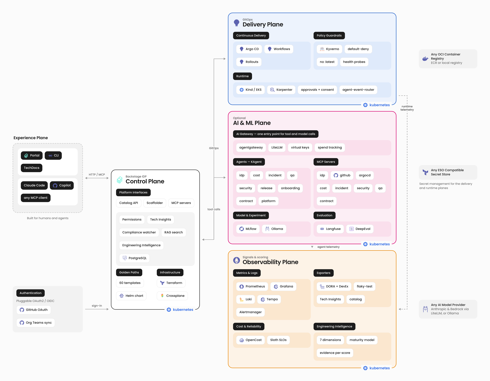
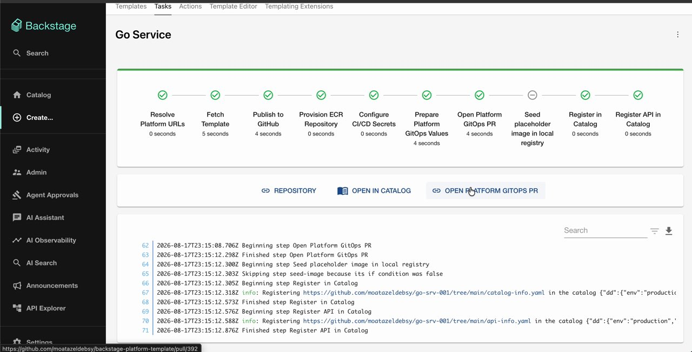

<div align="center">

# 🚀 Backstage Platform Template

### A production-ready Internal Developer Platform — in a single `git clone`

[](LICENSE)
[](https://github.com/moatazeldebsy/backstage-platform-template/actions/workflows/ci.yml)
[](https://sonarcloud.io/summary/new_code?id=moatazeldebsy_backstage-platform-template)
[](https://moatazeldebsy.github.io/backstage-platform-template/)
[](https://github.com/users/moatazeldebsy/projects/5)

A Backstage developer portal, golden-path Helm chart, 59 scaffold templates, an AI/ML platform and full observability — wired to both a local Kind cluster and AWS EKS. Runs locally in ~15 minutes.



<video src="https://github.com/user-attachments/assets/1f62cfc3-f645-4960-b0f7-9725324c9a13"
       poster="docs/assets/idp-platform-teaser-thumbnail.jpg"
       controls muted loop playsinline width="100%">
  <a href="https://github.com/user-attachments/assets/1f62cfc3-f645-4960-b0f7-9725324c9a13"></a>
</video>

**▶ [Watch the 75-second teaser](https://github.com/user-attachments/assets/1f62cfc3-f645-4960-b0f7-9725324c9a13)** · **[Screenshots](docs/screenshots.md)**

</div>

## What you get

- **Developer portal**: Backstage with catalog, TechDocs, Tech Radar and 59 software templates (services, QA suites, mobile, AI/ML, infra). See [Golden Path](docs/golden-path.md).
- **Golden-path chart**: one Helm chart for every service, with health checks, metrics, RBAC, PDBs and optional Argo Rollouts canaries.
- **Shift-left quality**: a Bronze/Silver/Gold scorecard, PR quality gates and contract testing. See [Shift-Left Leadership](docs/shift-left-leadership.md).
- **AI/ML platform**: KAgent agents, 8 MCP servers, MLflow and Langfuse, all behind one AI Gateway and LiteLLM. See [AI Assistant](docs/ai-assistant.md).
- **Observability**: Prometheus, Grafana, Loki, Tempo, Sloth SLOs, DORA and FinOps. See [DORA + FinOps](docs/dora-finops.md).
- **Engineering Intelligence**: evidence-backed health scores and a maturity model built from the platform's own telemetry. See [docs](docs/engineering-intelligence/product-vision.md).
- **Infrastructure**: Terraform for the foundation plus Crossplane for per-service resources, in one AWS region across three AZs. See [Crossplane vs Terraform](docs/crossplane-vs-terraform.md) and [ADR-0009](docs/design/adr-0009-single-region-multi-az.md).
- **Opt-in extra**: the [Agentic Development Platform](docs/agentic-platform.md), which adds agents behind a human-approval gate.

## Quick start

### Prerequisites

| Path | Install first |
|---|---|
| **Local (Kind)** | `git`, `docker`, `kind` ≥ 0.27, `kubectl`, `helm` ≥ 3.14 — `brew install kind kubectl helm docker` on macOS |
| **AWS** | Everything above, plus `aws` CLI (run `aws configure`), `terraform` ≥ 1.5, `jq` |

Give Docker **13 GB** for the core platform, or **16 GB** for everything including AI/ML. See [machine requirements](docs/local-setup.md#machine-requirements--and-what-to-do-if-you-dont-have-them).

### Install

Click **"Use this template"** on GitHub, then:

```bash
git clone https://github.com/<you>/<your-repo>.git && cd <your-repo>
./scripts/setup.sh
```

`setup.sh` is the only command you run by hand. It personalises the repo's placeholders, then asks **local or AWS** and runs the right installer for you. Don't run `bootstrap-local.sh` again afterwards: it has already run. To add the optional AI/ML stack, run `./scripts/bootstrap-ai.sh` (add `--aws` on EKS).

Day-2 operations (recreate, `--destroy`, `--start-backstage`, …) use the bootstrap scripts directly. See [Scripts Reference](docs/scripts-reference.md). For AWS, follow the [AWS Deployment Guide](docs/DEPLOYMENT_GUIDE.md) first.

### Open it

| Service | URL |
|---|---|
| Backstage | http://backstage.idp.local |
| Grafana | http://grafana.idp.local (`admin` / `admin`) |
| ArgoCD | http://argocd.idp.local |
| Prometheus | http://prometheus.idp.local |

All URLs and credentials: [Local Setup → Access services](docs/local-setup.md#access-services). Third-party accounts are optional; see [integrations](docs/local-setup.md#optional-third-party-integrations).

## Compatibility

| Component | Tested version |
|---|---|
| Backstage | v1.50.4 |
| Kubernetes | 1.35 (EKS) · 1.33.1 (Kind) |
| Helm | 3.x / 4.x |
| Kind | ≥ 0.27 |
| ArgoCD | v3.4 (chart 9.5.13) |
| Terraform | ≥ 1.5 (CI pins 1.10.5) |
| Go (hello-service) | 1.26 |
| Node.js (Backstage) | 22 or 24 (CI builds on 24; the MCP servers run on Node 20) |

## Documentation

| Doc | Description |
|---|---|
| [Local Setup](docs/local-setup.md) | Full local walkthrough, URLs, integrations |
| [AWS Deployment Guide](docs/DEPLOYMENT_GUIDE.md) | Step-by-step deployment and AWS costs |
| [Architecture](docs/architecture.md) | Platform planes, layers, known limitations |
| [Golden Path](docs/golden-path.md) | Scaffold → deploy → observe |
| [CLI Reference](docs/cli-reference.md) | The `idp` CLI |
| [Scripts Reference](docs/scripts-reference.md) | Every `scripts/*.sh` script |
| [AI Assistant](docs/ai-assistant.md) | KAgent, MCP servers, AI Gateway, Langfuse |
| [Troubleshooting](docs/TROUBLESHOOTING.md) | Common local and AWS issues |
| [Design decisions](docs/design/) | ADRs |
| [Roadmap](https://github.com/users/moatazeldebsy/projects/5) | GitHub Project board |

Full docs site: [moatazeldebsy.github.io/backstage-platform-template](https://moatazeldebsy.github.io/backstage-platform-template/).

## Contributing

Issues and PRs are welcome. Before opening a PR, run:

```bash
helm lint helm/service-template
cd backstage/app && yarn lint && yarn test
cd services/hello-service && go test ./...
cd cli && go build ./... && go vet ./...
```

If you touched `backstage/catalog/`, a `catalog-info.yaml`, an `mkdocs.yml` or any `docs/` content, also run:

```bash
pip install pyyaml mkdocs==1.6.1 mkdocs-techdocs-core==1.7.1 mkdocs-material==9.7.7
python3 scripts/validate-catalog-templates.py
python3 scripts/check-techdocs.py
```

Working with [Claude Code](https://claude.com/claude-code)? The repo ships skills and sub-agents under `.claude/` (`/platform-architect`, `/platform-engineer`, `/platform-reviewer`, …).

## License

[MIT](LICENSE) — free to use, fork, and build on.

<div align="center">

[](https://github.com/moatazeldebsy/backstage-platform-template/generate)

</div>
