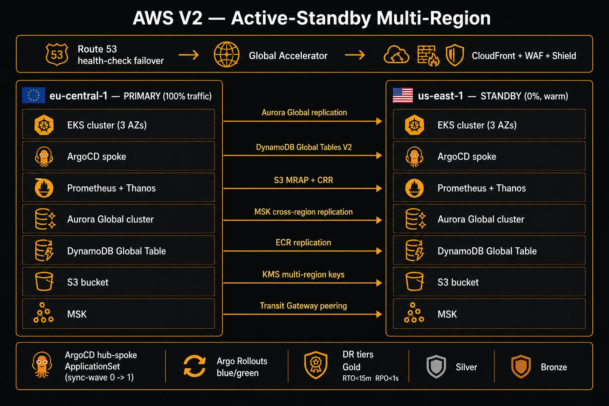

# V2 Multi-Region Architecture

> **Available on `main`** — merged in v2.
>
> The multi-region topology is opt-in. Single-region deployments (local Kind and single-region AWS)
> are fully unaffected — no changes to `bootstrap-local.sh` or `bootstrap.sh` are required.
> To deploy multi-region, use `./scripts/bootstrap-multiregion.sh` instead of `bootstrap.sh`.



## Topology

| Dimension | Value |
|-----------|-------|
| **Pattern** | Active-standby (not active-active) |
| **Primary region** | eu-central-1 (Frankfurt) — GDPR-aligned; Aurora writer, ArgoCD hub, Secrets Manager master |
| **Standby region** | us-east-1 (N. Virginia) — warm standby; Route 53 / Global Accelerator fails over automatically |
| **Account model** | Single AWS account, multi-region |
| **RTO / RPO** | RTO < 15 min (Gold tier), RPO < 1 s (Aurora Global) |

```
Internet
   │
   ▼
AWS Global Accelerator (anycast IPs, sub-30s failover)
   ├── Endpoint Group — eu-central-1  (trafficDial: 100%)   ← PRIMARY
   └── Endpoint Group — us-east-1    (trafficDial: 0%)      ← STANDBY (takes over on failure)
          │
          ├── CloudFront + WAF (static assets, TechDocs, SPA)
          ├── ALB  →  EKS Cluster (eu-central-1 or us-east-1)
          └── Route 53 health-check failover (DNS backup path)

Data layer:
  Aurora Global DB   eu-central-1 writer ──replicates──► us-east-1 reader (RPO < 1s)
  DynamoDB Global    active-active both regions (last-writer-wins)
  S3 CRR + MRAP      eu-central-1 source ──replicates──► us-east-1 replica
  MSK Replicator     eu-central-1 topics ──replicates──► us-east-1 topics
```

---

## What's in the Branch

### Phase 1 — Foundation

| Component | Path |
|-----------|------|
| Secondary EKS cluster (us-east-1) | `terraform/` applied per-region by `scripts/bootstrap-multiregion.sh` (`--standby-region`) |
| Route 53 + Global Accelerator + CloudFront | `terraform/global/` |
| ECR cross-region replication | `terraform/global/ecr-replication.tf` |
| Transit Gateway (inter-VPC, inter-region) | `terraform/global/transit-gateway.tf` |
| KMS multi-region keys | `terraform/global/kms.tf` |
| ArgoCD hub-spoke ApplicationSet matrix | `aws/argocd/app-of-apps.yaml` |
| Secrets Manager CRR + KMS replication | Terraform global module |

### Phase 2 — Data Replication

| Component | Details |
|-----------|---------|
| Aurora Global DB | Primary in eu-central-1; replica in us-east-1; global write forwarding (PG 16+) |
| DynamoDB Global Tables V2 | Active-active; PAY_PER_REQUEST; `replicaRegions: [us-east-1]` |
| S3 CRR + Multi-Region Access Point | Bi-directional replication; single MRAP endpoint |

### Phase 3 — Traffic & Resilience

| Component | Details |
|-----------|---------|
| Global Accelerator | Static anycast IPs; endpoint groups per region; health-check-driven failover |
| CloudFront + WAF | Origin failover (primary ALB → standby ALB); Shield Advanced; OWASP managed rules |
| Argo Rollouts | Blue/green per region; CloudWatch/Prometheus analysis gates; sync-wave ordering |
| DR runbook | `docs/runbooks/dr-region-failover.md` — Aurora promote + ProviderConfig flip + ArgoCD sync |

### Phase 4 — Observability & Security

| Component | Details |
|-----------|---------|
| Thanos | Sidecar per Prometheus; S3 object storage for long-term metrics; global Thanos Query |
| Security Hub | Aggregator in eu-central-1 aggregates GuardDuty findings from us-east-1 |
| CloudTrail | Organization trail → S3 CRR → immutable audit logs in both regions |
| Backstage multi-cluster plugin | Both clusters visible in entity Kubernetes tab |

### Phase 5 — Platform Wiring

- Platform S3 buckets with CRR for ArgoCD state and Backstage artifacts
- Transit Gateway peering between regional VPCs (non-overlapping CIDRs: `10.0.0.0/16` / `10.1.0.0/16`)
- Crossplane `ProviderConfig` per region (`default` → eu-central-1, `us-east-1` → us-east-1)
- Failover IRSA roles that can assume cross-region provider configs

### Phase 6 — Karpenter + Backstage HA

- Karpenter `EC2NodeClass` + `NodePool` per cluster (spot + on-demand mix, Graviton preferred)
- Backstage warm-standby wiring: Aurora Global read replica in us-east-1 serves read-only during failover

**Standby credentials.** The standby Backstage reads the same `backstage-secrets`
Secret as the hub. `idp-mvp/backstage` is replicated into the standby region by
Terraform (`aws_secretsmanager_secret.backstage` carries a `replica` block), and
`bootstrap-multiregion.sh` applies the SecretStore/ExternalSecret to the standby
cluster with **that cluster's** region substituted — the primary region's value
would not resolve there.

Order matters and is enforced by the script: namespaces → Backstage
ServiceAccount + IRSA → ExternalSecret (waited on) → Deployment. The standby
Deployment's `POSTGRES_*` and `AUTH_SESSION_SECRET` references are deliberately
**not** `optional`, so if the secret is missing the pod stays in
`CreateContainerConfigError` rather than starting up misconfigured and only
revealing the problem during an actual failover. Only the optional integrations
(Datadog, PagerDuty, Jira) are marked optional.

---

## Crossplane XRDs (V2)

### New XRDs

| XRD | Claim | Purpose |
|-----|-------|---------|
| `XECRReplicationRule` | `ECRReplicationRule` | Account-level ECR cross-region replication. One claim per account — platform team applies, not service teams. |
| `XRoute53HealthCheck` | `Route53HealthCheck` | Route 53 health check + optional DNS failover record (PRIMARY or SECONDARY). |
| `XGlobalAcceleratorEndpointGroup` | `GlobalAcceleratorEndpointGroup` | GA endpoint group per region. Set `trafficDialPercentage: 0` for the warm-standby region. |

All three live in `aws/crossplane/compositions/` alongside the existing five.
Example claims: `aws/crossplane/compositions/<name>/example-claim.yaml`.

### Extended XRDs (existing)

| XRD | New V2 fields |
|-----|---------------|
| `XS3Bucket` | `crossRegionReplication`, `replicaRegion`, `multiRegionAccessPoint` |
| `XRDSInstance` | `globalDatabase`, `replicaRegion`, `globalWriteForwarding` |
| `XDynamoTable` | `globalTable`, `replicaRegions[]` |
| `XKafkaTopic` | `crossRegionReplication`, `replicaRegion` |

---

## Backstage Templates (V2)

All four live under `backstage/catalog/templates/` and are indexed in
`backstage/catalog/all-templates.yaml` under the `Multi-region (V2)` section.

| Template | What it creates |
|----------|----------------|
| `aurora-global-cluster` | Renders Terraform tfvars + opens a PR; platform team applies via `terraform/global/` |
| `dynamodb-global-table` | Crossplane `DynamoTable` claim with `globalTable: true` and `replicaRegions: [us-east-1]` |
| `s3-multiregion-access-point` | Crossplane `S3Bucket` claim with `crossRegionReplication: true` and `multiRegionAccessPoint: true` |
| `eks-multi-region` | ArgoCD `ApplicationSet` (matrix generator) targeting both clusters; sync-wave 0 (eu-central-1) → wave 1 (us-east-1) |

---

## GitOps — ArgoCD Hub-Spoke

Primary ArgoCD in eu-central-1 manages both clusters. The V2 ApplicationSet uses a matrix generator:

```yaml
generators:
  - matrix:
      generators:
        - list:
            elements:
              - region: eu-central-1
                cluster: https://eks-eu-central-1.internal
                priority: primary
                wave: "0"
              - region: us-east-1
                cluster: https://eks-us-east-1.internal
                priority: secondary
                wave: "1"
        - list:
            elements:
              - service: <service-name>
                namespace: services
```

Sync-wave ordering ensures eu-central-1 is always deployed first. Argo Rollouts health gate in the primary region must pass before wave 1 proceeds.

---

## Disaster Recovery Tiers

| Tier | RTO | RPO | Data strategy | Traffic failover |
|------|-----|-----|---------------|-----------------|
| **Gold** (Backstage, platform core) | < 15 min | < 1 s | Aurora Global + DynamoDB Global | Global Accelerator automatic |
| **Silver** (stateful services) | < 1 hr | < 15 min | S3 CRR + Aurora read replica | Route 53 health-check |
| **Bronze** (stateless services) | < 4 hr | < 1 hr | S3 backup restore | Manual DNS update |

---

## Opting In

Teams that need multi-region support should:

1. Clone or pull `main` — multi-region scripts and templates are included.
2. Use the V2 Backstage templates (available in the Create page — search for "Multi-Region" or "V2").
3. Enable V2 fields on existing XRDs (`crossRegionReplication: true`, `globalTable: true`, etc.) in their Crossplane claims.
4. Apply the three new platform-level claims (`ECRReplicationRule`, `Route53HealthCheck`, `GlobalAcceleratorEndpointGroup`) via the platform team.

---

## Go-Live Readiness Checklist

The architecture and scaffolding above are built; actually cutting over to multi-region for a
production workload with real (patient) data is a separate, deliberate decision — not something to
flip on as a side effect of a platform update. Use this checklist before running
`./scripts/bootstrap-multiregion.sh` against a production account:

- [ ] **Data residency sign-off** — Legal has confirmed the cross-region replication path (eu-central-1
      → us-east-1) is covered by a valid transfer mechanism for whatever data this deploys with — this is
      not automatically true just because the infrastructure exists.
- [ ] **Cost approval** — a second full region (EKS, Aurora Global writer/reader, cross-region ECR
      replication, Transit Gateway, Global Accelerator) is a material recurring cost increase; get
      sign-off before enabling, not after the first bill.
- [ ] **DR tier assigned per service** — every service that will run multi-region has an explicit
      Gold/Silver/Bronze tier assignment (see the table above), not just an inherited default. A
      service handling booking writes should be Gold; a batch reporting job probably shouldn't be.
- [ ] **Failover runbook rehearsed** — the region failover procedure has been run at least once against
      a non-production environment, by someone other than whoever wrote it, so a real incident isn't
      the first time it's executed.
- [ ] **Alerting wired to the standby region** — confirm Thanos/Grafana actually alerts on standby-region
      health (not just primary), otherwise a degraded standby fails silently until the moment you need it.
- [ ] **Rollback path confirmed** — know how to disable multi-region (fail back to single-region) if
      something goes wrong during cutover, before you need to do it under pressure.

This checklist is intentionally a gate, not a script — running `bootstrap-multiregion.sh` is a
one-way door for a live production account and should be triggered explicitly by whoever owns that
decision, not automated.

---

## See Also

- [crossplane.md](crossplane.md) — full XRD reference including V2 extensions
- [docs/runbooks/dr-region-failover.md](runbooks/dr-region-failover.md) — step-by-step region failover procedure
- [GitHub Project](https://github.com/users/moatazeldebsy/projects/5) — multi-region tracked under the Phase 9 "Advanced Platform" milestone
